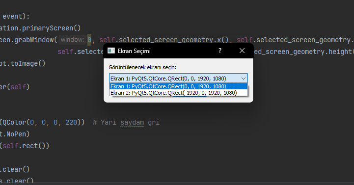

# BloodVision-Tracker

**BloodVision-Tracker**: A screen filter and tracker based on PyQt5 that detects red pixels and allows interaction only within those areas.

---

## Features

- **Red Pixel Detection**: Analyzes the red pixels on the screen and highlights only those regions.
- **Soft Edges and Blinking Effect**: Creates soft edges around red areas and enables the screen to blink.
- **Python + PyQt5**: Developed using Python and PyQt5.
- **Screen Selection**: Supports multiscreen setup and allows you to choose a specific screen to work on.

---

### **Red Pixel Detection**

This section shows how red pixels are detected and how interaction is provided only in those areas. Each mode has different features.

GIFs might take a bit to load, so grab a coffee, kick back, and get ready to witness the beauty unfold!

#### 1. **Basic Mode**  
     
   *This GIF shows how red pixels are detected and focuses only on red regions.*

#### 2. **Soft Edges**  
     
   *Interaction occurs only in the red areas on the screen, and only these regions are clickable.*

#### 3. **Soft Edges and Blinking Effect**  
     
   *Soft edges form around red areas, and the screen blinks.*

#### 4. **From LOL Game**  
     
   *This GIF demonstrates how red pixels are detected and highlighted in a LOL game.*

---

### Screenshots

1. **Screen Selection and General View**  
     
   *Shows which screen is selected when multiple screens are present.*

---

## Installation and Usage

### Required Dependencies

- Python 3.x
- PyQt5

```bash
pip install PyQt5
```
